---
## Front matter
lang: ru-RU
title: Установка ОС на виртуальную машину
author: |
	 Виноградова Варвара НФИбд-01-18\inst{1}

institute: |
	\inst{1}Российский Университет Дружбы Народов

date: 17 сентября, 2021, Москва, Россия

## Formatting
mainfont: PT Serif
romanfont: PT Serif
sansfont: PT Sans
monofont: PT Mono
toc: false
slide_level: 2
theme: metropolis
header-includes: 
 - \metroset{progressbar=frametitle,sectionpage=progressbar,numbering=fraction}
 - '\makeatletter'
 - '\beamer@ignorenonframefalse'
 - '\makeatother'
aspectratio: 43
section-titles: true

---

# Цели и задачи работы

## Цель лабораторной работы

Приобретение практических навыков установки операционной системы на виртуальную машину, настройки минимально необходимых для дальнейшей работы сервисов

# Процесс выполнения лабораторной работы

## Создаю виртуальную машину, выбираю тип конфигурации

{ #fig:001 width=70% }

## Выбираю файл образа, скаченный заранее.

{ #fig:002 width=70% }

## Называю виртуальную машину по своему имени. 

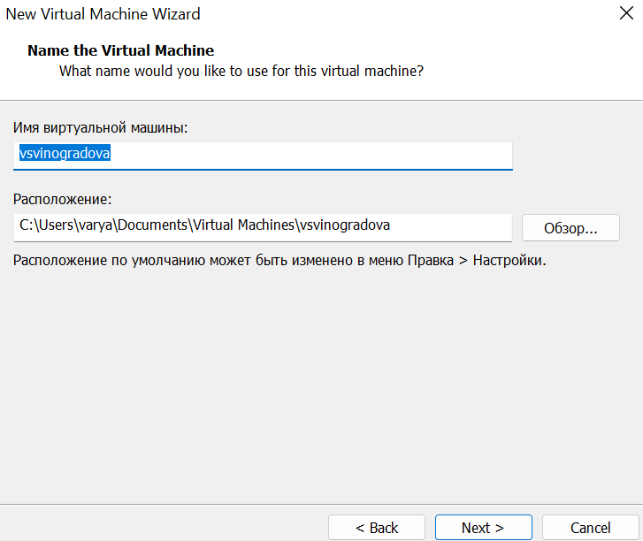{ #fig:003 width=70% }

## Увеличиваю число ядер до 4-х. 

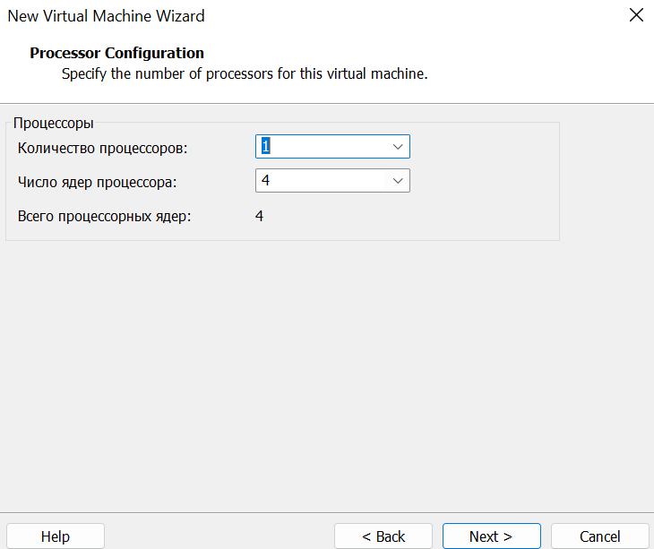{ #fig:004 width=70% }

## Оставляю по умолчанию память для виртуальной машины. 

{ #fig:005 width=70% }

## Создаю новый виртуальный диск. 

{ #fig:006 width=70% }

## Увеличиваю память виртуального диска до 40 Гб. 

{ #fig:007 width=70% }

## Следующие настройки оставляю по умолчанию и запускаю виртуальную машину.

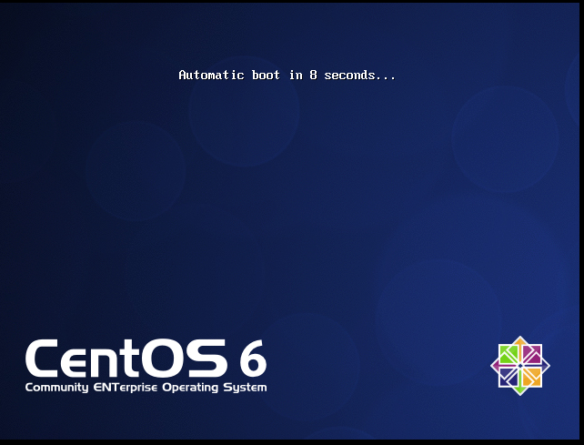{ #fig:008 width=70% }

## Устанавливаю жесткий диск. Выбираю язык.

{ #fig:009 width=70% }

## Указываю параметры установки

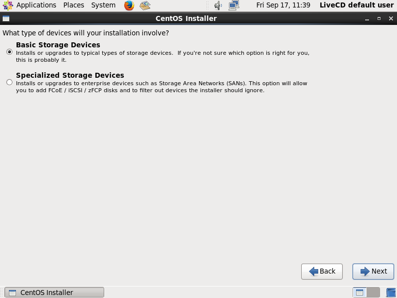{ #fig:010 width=70% }

## Установка разбиения диска

{ #fig:011 width=70% }

## Установка имени хоста

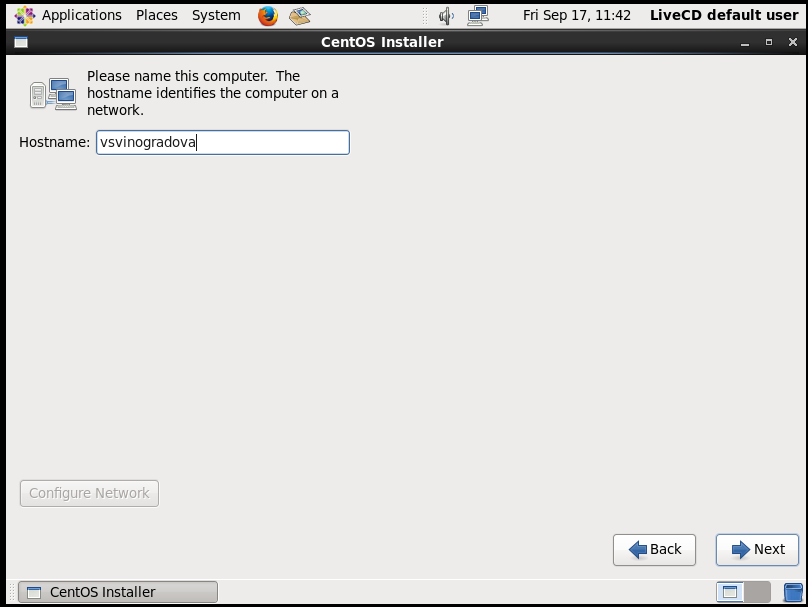{ #fig:012 width=70% }

## Установка часового пояса
 { #fig:013 width=70% }

## Создаю пароль суперпользователя

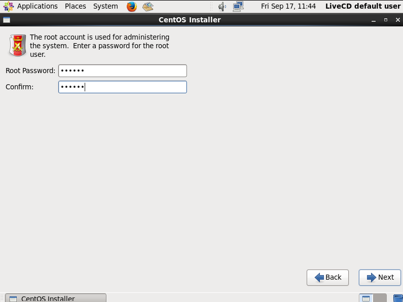{ #fig:014 width=70% }
 
## Перехожу к этапу установки и дожидаюсь его завершения.

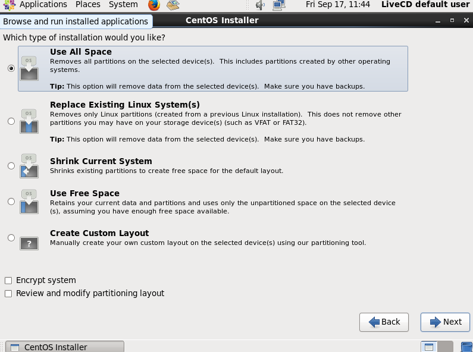{ #fig:015 width=70% }

## Этап установки

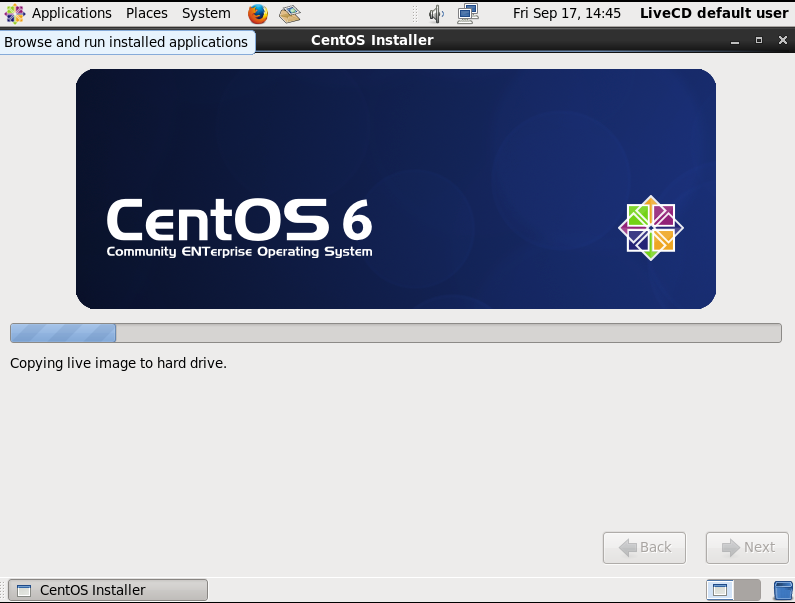{ #fig:016 width=70% }

## Завершение установки

 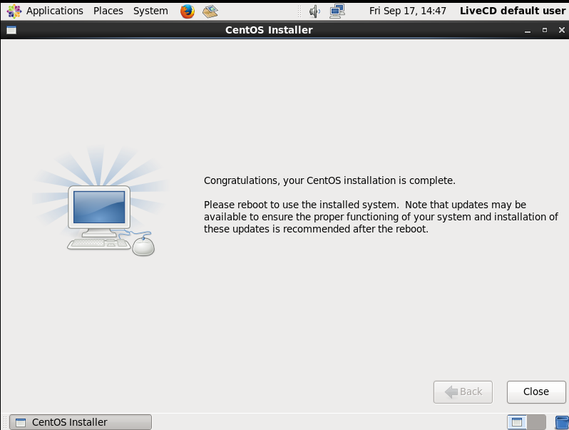{ #fig:017 width=70% }

## Загружаю с жесткого диска установленную систему

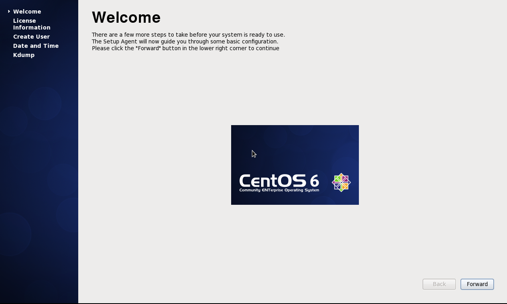{ #fig:018 width=70% }

## Соглашаюсь с лицензионным соглашением

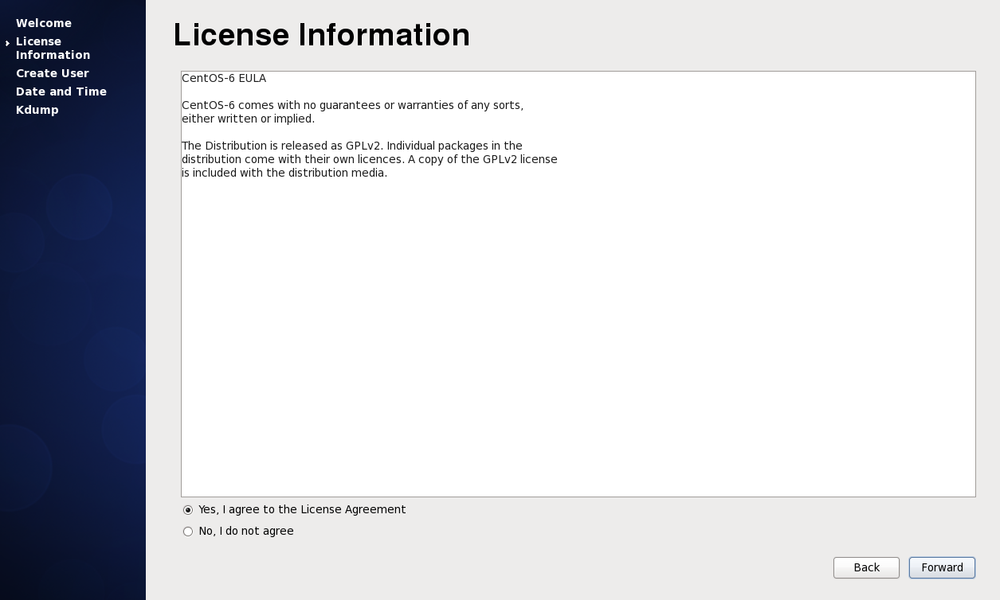{ #fig:019 width=70% }

## Создаю пользователя 

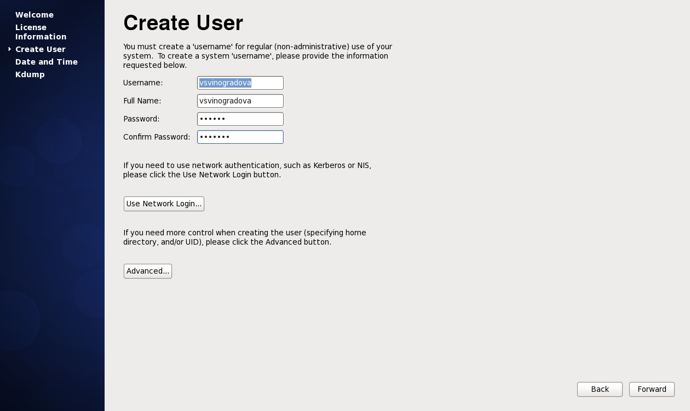{ #fig:020 width=70% }

## Устанавливаю дату и время

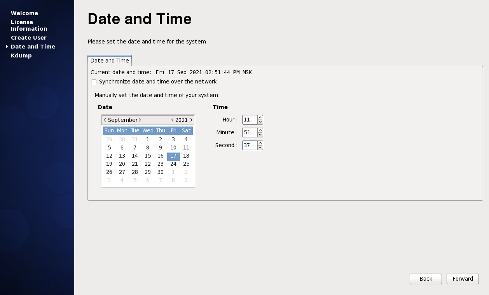{ #fig:021 width=70% }

## Запущенная CentOS

 { #fig:022 width=70% }

# Вывод

Я приобрела навык установки операционной системы на виртуальную машину, разместила файлы работы на сервисе Git и подготовила отчет в формате Markdown.
