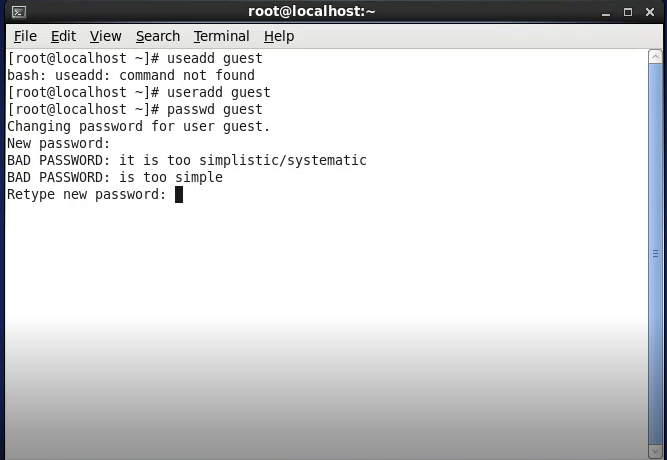
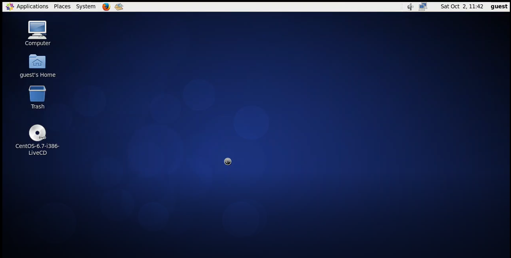
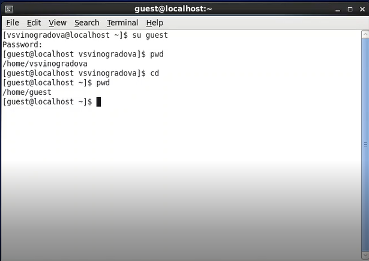
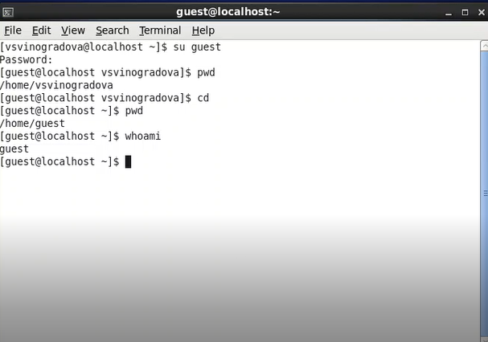
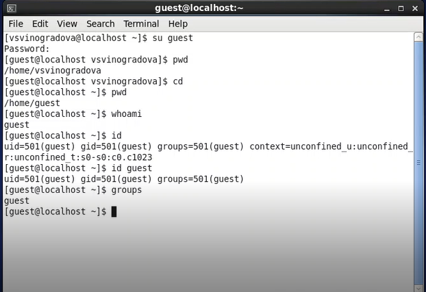
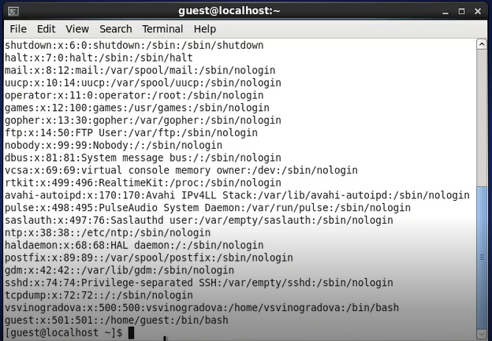
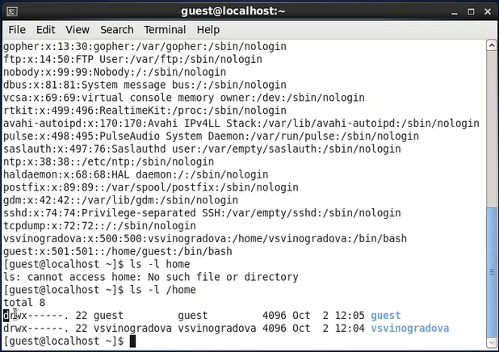
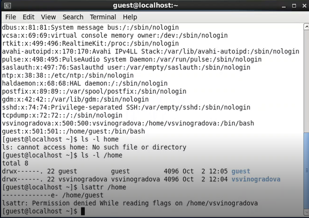
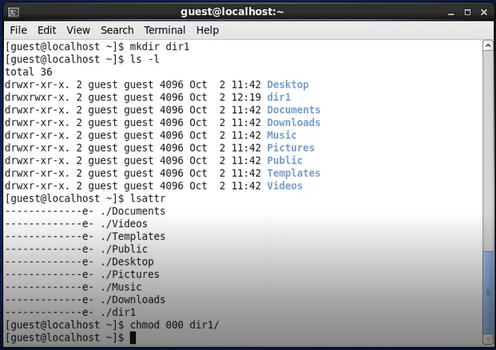
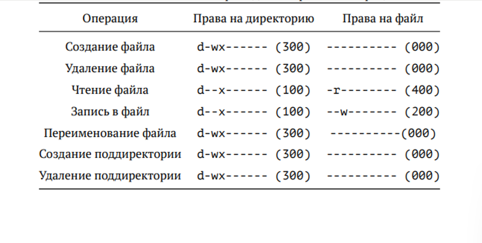

---
## Front matter
lang: ru-RU
title: Дискреционное разграничение прав в Linux. Основные атрибуты
author: |
	 Виноградова Варвара НФИбд-01-18\inst{1}

institute: |
	\inst{1}Российский Университет Дружбы Народов

date: 02 октября, 2021, Москва, Россия

## Formatting
mainfont: PT Serif
romanfont: PT Serif
sansfont: PT Sans
monofont: PT Mono
toc: false
slide_level: 2
theme: metropolis
header-includes: 
 - \metroset{progressbar=frametitle,sectionpage=progressbar,numbering=fraction}
 - '\makeatletter'
 - '\beamer@ignorenonframefalse'
 - '\makeatother'
aspectratio: 43
section-titles: true

---

# Цели и задачи работы

## Цель лабораторной работы

Получить практические навыки работы в консоли с атрибутами файлов, закрепить теоретические основы дискреционного разграничения доступа в современных системах с открытым кодом на базе ОС Linux.

## Процесс выполнения лабораторной работы

В установленной при выполнении предыдущей лабораторной работы операционной системе создали учётную запись пользователя guest (используя учётную запись администратора) и задали пароль для пользователя guest (используя учётную запись администратора)

{ #fig:001 width=50% }

## Процесс выполнения лабораторной работы

Вошли в систему от имени пользователя guest

{ #fig:002 width=70% }

## Процесс выполнения лабораторной работы

Командой pwd определили директорию, в которой находимся и определили является ли она домашней директорией

{ #fig:003 width=70% }

## Процесс выполнения лабораторной работы

Уточнили имя нашего пользователя командой whoami:

{ #fig:004 width=70% }

## Процесс выполнения лабораторной работы

Уточнили имя пользователя, его группу, а также группы, куда входит пользователь, командой id. Выведенные значения uid, gid и др. Сравнили вывод id с выводом команды groups. Видим, что gid и группы = 501(guest)
Сравним полученную информацию об имени пользователя с данными, выводимыми в приглашении командной строки и убедимся, что они совпадают

{ #fig:005 width=30% }

## Процесс выполнения лабораторной работы

Просмотрим файл /etc/passwd Командой: cat /etc/passwd. Найдем в нём свою учётную запись. Определим uid пользователя. Определим gid пользователя. Сравним найденные значения с полученными в предыдущих пунктах. Guest имеет те же идентификаторы 501, наш пользователь под идентификатором 500.

{ #fig:006 width=50% }

## Процесс выполнения лабораторной работы

Определим существующие в системе директории командой ls -l /home/

{ #fig:007 width=50% }
 
## Процесс выполнения лабораторной работы

Проверили, какие расширенные атрибуты установлены на поддиректориях, находящихся в директории /home, командой: lsattr /home. Нам не удалось увидеть расширенные атрибуты директорий других пользователей, только своей домашней директории.

{ #fig:008 width=50% }

## Процесс выполнения лабораторной работы

Создали в домашней директории поддиректорию dir1 командой mkdir dir1. Определим командами ls -l и lsattr, какие права доступа и расширенные атрибуты были выставлены на директорию dir1.

Сняли с директории dir1 все атрибуты командой chmod 000 dir1 и проверили с ls -l помощью правильность выполнения команды chmod.

## Процесс выполнения лабораторной работы

Создали в директории dir1 файл file1 командой echo "test" > /home/guest/dir1/file1. Поскольку ранее мы отозвали все атрибуты, то тем самым лишили всех прав на взаимодействие с dir1.

{ #fig:009 width=50% }

## Права и разрешённые действия

{ #fig:010 width=70% }

##  Выводы по проделанной работе

В ходе выполнения лабораторной работы были получены навыки работы с атрибутами файлов и сведения о разграничении доступа.